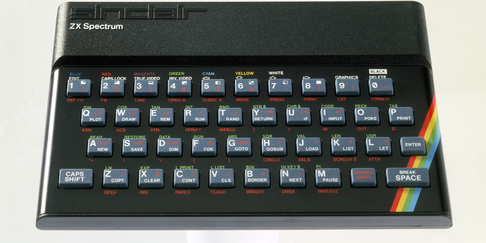
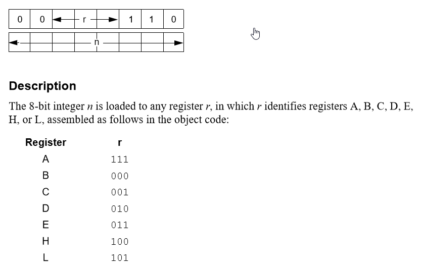
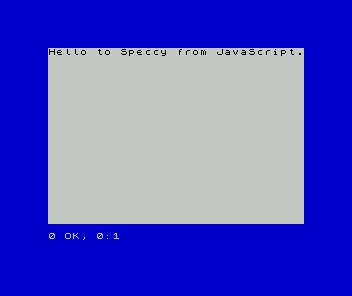

# Generating (Z80) machine code for ZX Spectrum with JavaScript



## Background

(Don't worry, I will get to the JavaScript code explanation; you can scroll 
down to skip to that if you want.  (You will need Node.js)).

Over the last few months I have been pretty interested in the ZX Spectrum
microcomputer.  I'm not sure what made me start thinking about it.
It may have been some video from [Lazy Game Review](https://youtu.be/tqnIa4rXK_c) or [Terry Stewart](https://youtu.be/cCqXqYRlQt0).

Regardless of what started it, this computer is very interesting to me.  If I'm
honest, it is probably largely a shallow motivation.  Tiny computers are cool, and the
design of this one is just colorful and very attractive.

But deeper than that, this computer has a lot going for it.  There are TONS of
games and utilities to play with.  The Z80 CPU, in my opinion, is also fairly
user-friendly in certain ways, so far as relatively early processors go.

I had initially planned on doing much of my experimentation on a real ZX Spectrum, in a 'real' assembler typing on the authentic (yet reportedly somewhat maddening) real Spectrum keyboard.  I even downloaded ZX native assembler/debugger/dev tool called [HiSoft DevPac 4](http://www.worldofspectrum.org/infoseekid.cgi?id=0008091) from [World of Spectrum](http://www.worldofspectrum.org).  Then,
I took the extraordinary step of actually sending the guys who made this software some money.  This was mainly a spur-of-the-moment idea to assuage some of my
guilt for downloading so much 'free' software over the years.  

By the way, the HiSOFT that created DevPac 4 for the ZX Spectrum is [still around](http://www.hisoft.co.uk/).  According to their about page they now build websites?!??..?  So.. I always thought the 'real' programmers were the guys cranking
out assembler code in the 80s.. apparently now those guys are web developers too.  Not sure if that is really cool or slightly tragic in a way.  Just kidding.  JavaScript is definitely very powerful once you understand it.

## Emulators, assemblers, references

Anyway, I have not yet purchased an _actual_ Spectrum, but have gone through
a number of emulators and assemblers (including the HiSOFT assembler, which I
did eventually figure out how to work inside of an emulator).

The program that I prefer is called [ZX Spin](http://www.zophar.net/sinclair/zx-spin.html) and it runs on Windows.  It has a built in assembler, debugger, etc. and actually works great (which is more than I can say for some othe ZX Spectrum emulators). 
There are lots of other ZX Spectrum assemblers out there for different platforms.  Again, whichever one you pick, you just need to make sure it actually works.

Since I do Node.js development in Ubuntu on a VPS or Virtual Box, I have had to transfer the output binary from my experiment code onto the Windows
drive to test it.  Not sure if Node really works on Windows now, I haven't tried and wouldn't recommend it.

The ZX Spectrum uses a Z80 CPU.  As I have been learning Z80 assembly bit-by-bit the [user manual](http://www.zilog.com/appnotes_download.php?FromPage=DirectLink&dn=UM0080&ft=User%20Manual&f=YUhSMGNEb3ZMM2QzZHk1NmFXeHZaeTVqYjIwdlpHOWpjeTk2T0RBdlZVMHdNRGd3TG5Ca1pnPT0=) from zilog.com has been really useful.

Another page/site that has been very helpful is [this one](http://www.animatez.co.uk/computers/zx-spectrum/screen-memory-layout/) about the ZX Spectrum's screen memory layout.

## _Why_ use JavaScript to generate ZX Spectrum machine code?

The most realistic answer is probably just because it was a fun, interesting, and approachable exercise for me.  But to explain, I was playing with the ZX Spin assembler, referring back and forth to various pages in the Z80 manual, and eventually realized that the machine code required for each instructions was not,
in fact, very complicated.  Its just a few bits in a specific place and one or two other bytes of data.

So I wanted to try generating my own simple machine code binary files, and thought I could also take advantage of JavaScript as a type of macro language to generate instructions.  I briefly considered creating a 'real' assembler -- but that would require writing a parser and then writing the code in another language, and I like JavaScript.

One (possible) advantage of doing it this way is that there is the option of distributing Z80/ZX routines as JavaScript modules via npm and so gaining the capabilities of that package system.

## Assembly language and machine code

I'm not going to give a really detailed explanation because there are already a million
explanations of what assembly language and machine code are out there on the web.  But briefly, machine code is what CPUs actually understand, and assembly language mnemonics are the human-readable versions of those machine instructions.

So I will get straight into explaining the JavaScript code (finally).  I decided
not to use actual assembly language mnemonics, for a few reasons.  One, this is not an assembler -- its similar since it is generating machine code, but its my own simple approach, not an assembly language.  Second reason is, when they came up with the concept of assembly language, computers could generally only show like 30 or 50 columns on the screen.  Now we have amazing things like _resolution_ and scroll bars.  So I don't need to save space with my command names. I also just honestly like more descriptive function names and identifiers rather than abbreviated ones.

## ZX Spectrum ROM routines

The ZX Spectrum comes with some built-in ROM routines that make it possible
to do some somewhat interesting things with just a few function calls.
Which is not actually hard to do, even in machine code.

Unfortunately, I was not able to find a reference for the addresses and features of these ROM routines.  Rather I had to rely on scattered [blog posts](https://chuntey.wordpress.com/2012/12/18/how-to-write-zx-spectrum-games-chapter-1).

So, for example, take a look at line 14 in the main program file, which is [`src/testzx.js`](https://github.com/runvnc/z80-machine-code/blob/2132bb30a1fc9562d1cf37d88b348e67ea9b9d22/src/testzx.js#L14):

```javascript
loadByteIntoRegister({data: blueBorder, register: accumulator});
```

That is my version of `LD a, 1` (blueBorder is defined as a const number 1 in `src/zxspectrum.js`).  What this means is to put the value 1 into the A (accumulator) register.  A register, by the way, is basically a memory position or variable that the CPU can access very quickly, and registers like the accumulator are very commonly used as parameters for built-in (ROM) routines (function calls).

In this case, there is a function call that allows you to easily change the border color of the screen on the Spectrum.  All you have to do is put a number representing the color in the A register and then CALL this built-in routine.

## Actually generating the machine code bytes

Back to the Load instruction.  There are quite a few variations of load (LD), which is used to move data between registers and memory.  The one that I implemented, `LD r, n` is on page 69 of the Z80 manual.  This is the version that loads a byte into a register, so I called it `loadByteIntoRegister`.

The core information on that page is this little diagram (sorry there is a cursor [hand] left in the screenshot):



That means in order to indicate this instruction, we need to output two bytes: the first has certain bits always on or off, with the register indicated by a pattern of bits in the middle, and the second byte (n) is the data to store in the register.

My solution for outputting the machine code is to have a function that appends a byte to an output array, call that repeatedly, working out each byte one at a time, and then at then end just create a Buffer from the array and write it to a file.  So in the following code for loadByteIntoRegister, from `src/z80.js`, `binOut` is the function that pushes bytes to the end of the output array:

```javascript
binOut(bits(`00${register}110`));
binOut(data);
```

On the off chance you aren't familiar, the backticks contain a template string, so it will insert the value of `register` in the middle of the string.  The value of `register` passed in this case is 'accumulator' which is a constant defined in `z80.js` as '111'.  That corresponds to the first row of the table from the Z80 manual page above, register A (also known as the accumulator).  So that is `bits('00111110')`'  The `bits` function is very simple, it just converts from this string representation of the bits in the number to a normal JavaScript number.  That is actually built in to JavaScript: its just `parseInt(num, 2)` which means parse an integer as a radix 2 (binary) number.  JavaScript makes things quite convenient.  The next line appends the 'data' byte (n) to the output array and that instruction is done being 'assembled'.

## CALLing routines


## Testing the program on the Speccy



